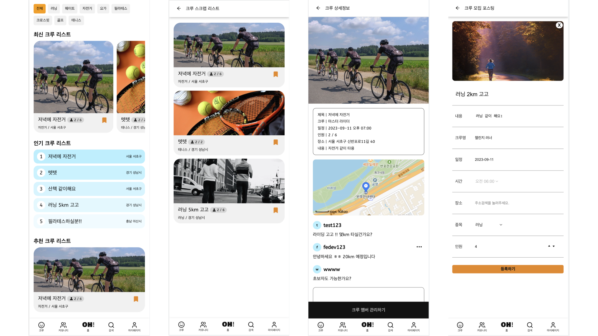
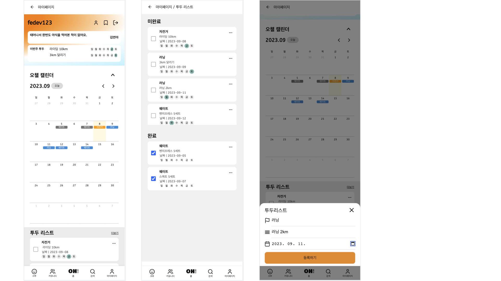
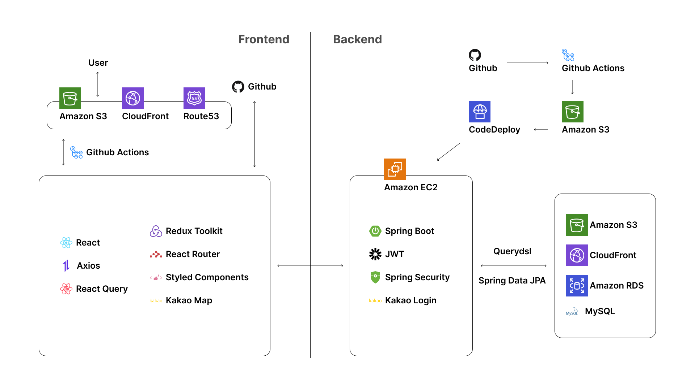

## OHCHALLE

OHCHALLE은 다양한 종목의 운동 크루를 만들고 운동 스케줄과 데이터를 기록할 수 있는 서비스입니다.

오늘부터 운동은 오챌과 함께!

## KEY FEATURES

운동 크루 서비스

+ 러닝, 웨이트, 자전거, 요가, 필라테스 등 다양한 운동 크루를 만들 수 있어요.

+ 마음에 드는 크루가 있다면 바로 참가 신청하기!

나만의 운동 플래너

+ 나만의 운동 스케줄, 데이터를 기록할 수 있는 플래너 제공!

+ 매주 운동 목표를 설정하고 달성하세요.

OHCHALLE SNS

+ 신기록 달성, 오운완을 자랑하고 공유해요!

+ 댓글, 좋아요 기능으로 즐겁게 소통해요.

## SERVICE ARCHITECTURE

## STACK

  
  
  
  
  
  
  
  
  
  
  
  
  
  

